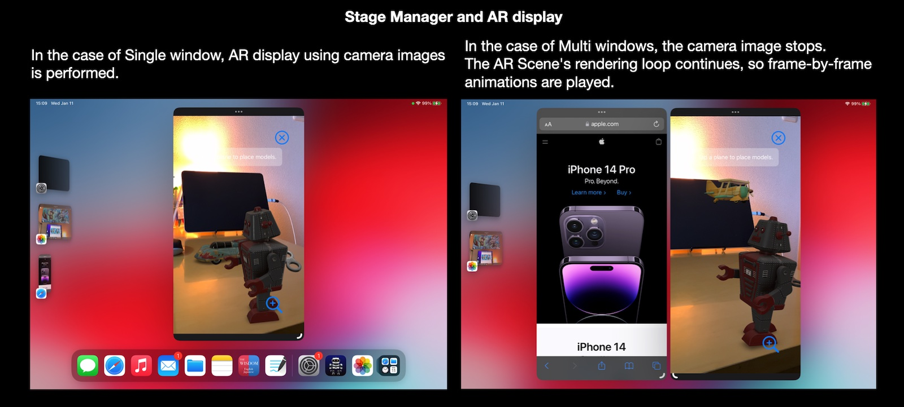
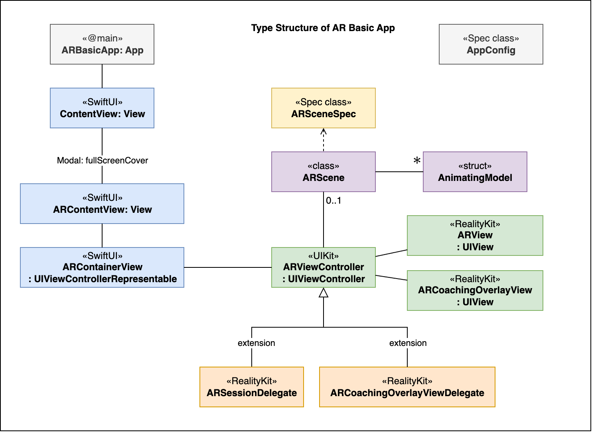
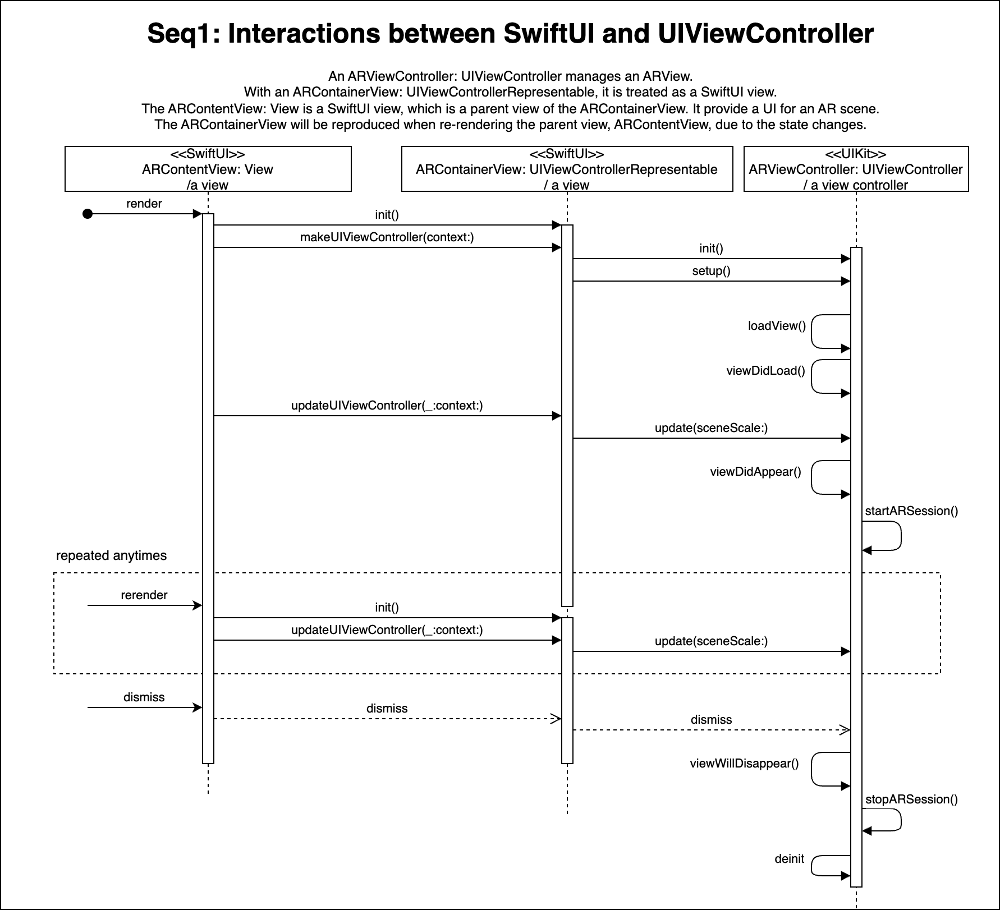
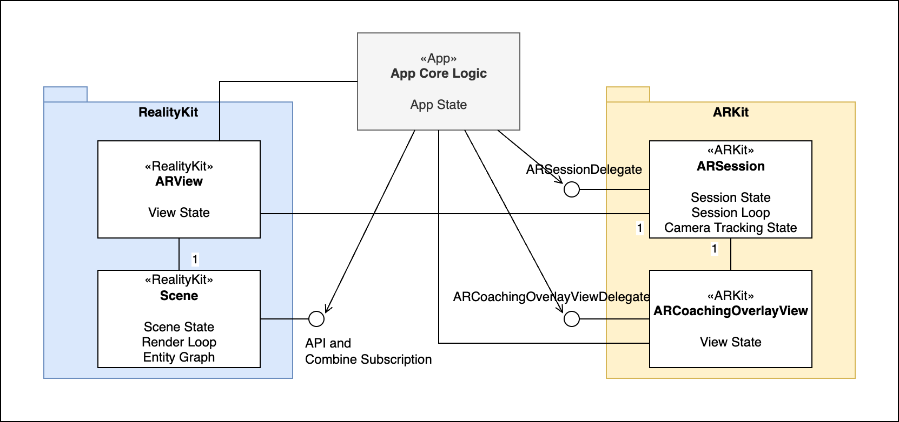
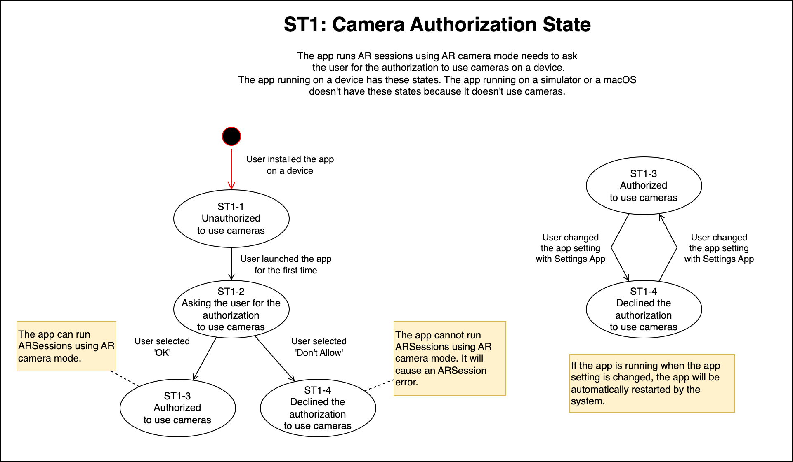

# iOS app - AR Basic App

A minimal iOS AR app that can be used as a template when creating an AR app for the first time.

- Target devices: iPhone / iPad / Mac with M1/M2 (Designed for iPad)
- Target OS: iOS 16.0+, iPadOS 16.0+, macOS 13.0+
- Build system: Xcode 14.0+
- SDK: SwiftUI, ARKit, RealityKit

No special features are used, so you can easily make it compatible with iOS 15/macOS 12.
(I haven't tested it.)

## Change Log

none

## Abstract

This is a minimal iOS AR app.
The purpose of this app is showing the basic structure and code for AR apps.

The app uses the simple `ARWorldTrackingConfiguration` and Plane-Detection.
Once you understand the basic structure and code,
you can apply it to other configurations such as Image-Detection, Object-Detection,
Face-Tracking, and Body-Tracking.

Thanks to RealityKit, drawing AR/VR scenes is easy.
This app just draws a few animated 3D models with sound.
This also works when running on a Mac without ARKit support, or when running in Xcode/simulator.
It makes the AR app development easy.
After understanding AR Scene drawing with RealityKit, you will be able to draw more complex
3d models and express complex animations using physics simulation built in RealityKit.

In order to focus on the basics, this project does not deal with RealityKit2 GeometryShader
or post processing with Metal/Metal Performance Shader/Core Image.
For these, please check my other iOS app projects on GitHub.

### Features

- You can place 3D models on a plane by tapping on the horizontal or vertical plane.
You can tap other planes to move the models.
- The baked animations of the model, such as walking, are played.
- The procedural frame animations, such as moving in a circle, are played.
- The spacial audio is played.
- You can change the size of the models by tapping the resize button.
- If the relocalize doesn't end, you can reset the AR session by tapping the `Start Over` button
in the Coaching Overlay View.

### Behavior when using Stage Manager

As long as the app is in the foreground, the AR Scene will continue to draw.
However, camera image processing is performed only for single window.

- Single window: Camera images are processed.
- Multi windows: Camera images are not processed.

### ARKit support on various devices

As iOS and iPadOS support ARKit, AR apps running on devices process camera images and track the real world.

Apps running in Simulator can not process camera images. However RealityKit can draw VR scenes in Simulator.
This helps the AR app development.

ARKit is not supported for running iOS apps on macOS.
Even in this case, it is possible to draw VR scenes with RealityKit.
This is useful for some applications.

- iPhone / iPad can handle AR scenes.
- Simulator / macOS with M1/M2 can handle VR scenes.
(macOS with Intel does not support running iOS apps.)

### Customization

You can modify the app with the `AppConfig.swift` file.

- displaying AR debug options: Enable | Disable
- enabling the Environment Texturing: Enable | Disable
- enabling the Object Occlusion: Enable | Disable
- enabling the People Occlusion: Enable | Disable
- background color of AR scene when running on simulator or macOS: `UIColor`
- AR scene scales that user can change: `[SIMD3<Float>]`
- scale and position of models when running on simulator or macOS:
`SIMD3<Float>, SIMD3<Float>`

### Procedural Animations

You can modify the procedural frame animations.

- The assets of AR/VR scenes are defined in `ARSceneSpec.swift` file.
It defines the USDZ model files, sound files, and procedural animation's parameters.
- The procedure of frame animations is defined in `AnimationModel.swift` file.
It defines a simple movement in a circle.

### Assets

This project contains a few USDZ models and audio files as samples.

- USDZ models: `toy_robot_vintage.usdz`, `toy_biplane.usdz`, and `toy_car`
These are from the Apple's AR Quicklook library.
(https://developer.apple.com/augmented-reality/quick-look/)
- Sound files: `robotSound.mp3`, `planeSound.mp3`, and `carSound.mp3` (all free assets)

## Design

### Xcode project

This project was created with the following settings.

- Choose a template for your new project: Multiplatform: `iOS`, Application: `App`
- Choose options for your new project: Interface: `SwiftUI`, Language: `Swift`

At project settings;
- Info: iOS Development Target: `16.0`

At targets settings;
- Info: Custom iOS Target Properties - add key `Privacy - Camera Usage Description` 
and value `The app will use the camera for AR.`

### Type Structure

The app consists of simple SwiftUI Views, UIKit Views, UIViewController, and Data types (Model types).

### SEQ1: Interactions between SwiftUI View and UIViewController

The UI for AR Screen is provided by SwiftUI, and AR Scene drawing is provided by UIKit.
The interaction between the two is a little trickier to understand.

When the SwiftUI state changes, a re-render is performed, which rebuilds `ARContainerView: UIViewControllerRepresentable`.
After that, `updateUIViewController(_:context:)` is called.

- An ARViewController: UIViewController manages an ARView.
- With an ARContainerView: UIViewControllerRepresentable, it is treated as a SwiftUI view.
- The ARContentView: View is a SwiftUI view, which is a parent view of the ARContainerView. It provide a UI for an AR scene.
- The ARContainerView will be reproduced when re-rendering the parent view, ARContentView, due to the state changes.

### AR State Management

ARKit's internal state is automatically controlled,
but the App state and RealityKit state must be coordinated by the developer,
using delegate calls, `ARSessionDelegate` and `ARCoachingOverlayViewDelegate`.

In this app,
- Unauthorized camera state is handled as an ARSession error.
- ARSession error state is handled as an App error, which shows an error dialog.
- Camera tracking state is handled as just a debug info. User interaction is left to `CoachingOverlayView`.
- If the user requests to reset relocalization via CoachingOverlayView,
  delete the RealityKit Scene and restart the ARSession.
  (Relocalization doesn't work well if the interrupt end of the ARSession happens in a different place than before.)

ARKit takes care of handling the ARSession when the app goes to the background or when the device is locked.
However, in some cases we need to coordinate ARSession state changes with App state and RealityKit state.
This must be done by the developer using ARKit's Delegate calls.

See below, General description of AR State, for details.

## General description of AR State

There are several states and state transitions related to AR in ARKit.
ARKit's internal state is automatically controlled,
but the App state and RealityKit state must be coordinated by the developer.
Use delegate calls, `ARSessionDelegate` and `ARCoachingOverlayViewDelegate`, for that.

1. Camera authorization state
1. Camera tracking state
1. ARSession state
1. CoachingOverlayView state

### ST1: Camera Authorization

- The app runs AR sessions using AR camera mode needs to as the user for the authorization 
to use cameras on a device.
- The app running on a device has these states. The app running on a simulator or a macOS 
doesn't have these states because it doesn't use cameras.

### ST2: Camera Tracking State

- The session(_:cameraDidChangeTrackingState) delegate is called when the camera tracking state changes.
- In fact, there are also state transitions that do not go through 'Not available'.
- Relocalize may not be possible in some cases. CoachingOverlayView allows users to request
a session reset by tapping the Start Over button.
- The app running on a device has these states. The app running on a simulator or a macOS
doesn't have these states because it doesn't use cameras.

### ST3: ARSession State

- The session delegate is called when the AR session's state changes.
- The AR session can run when the app is foreground and its window is only one in the screen.
- In other cases, such as being in background or displaying multi-windows, the AR session will be interrupted.
- During the AR session is interrupted, the camera feeds are not processed. However if the app is foreground,
the ARView's scene continues updating.
- If an error occurs, you need to restart the AR session to recover from the error.
- The app running on a device has these states. The app running on a simulator or a macOS
doesn't have these states because it doesn't run AR sessions.

### ST4: CoachingOverlayView State

- The ARCoachingOverlayView can be set to activate automatically according to the camera tracking status.
- The view displays the `Start Over` button during relocalizing.
Users can request the AR session reset by tapping the button.
- The app running on a device has these states. The app running on a simulator or a macOS
doesn't have these states because it doesn't run AR sessions.

## References

- Apple AR QuickLook: https://developer.apple.com/augmented-reality/quick-look/
- Apple Documentation - ARKit: https://developer.apple.com/documentation/arkit
- Apple Documentation - RealityKit: https://developer.apple.com/documentation/realitykit/

## License

