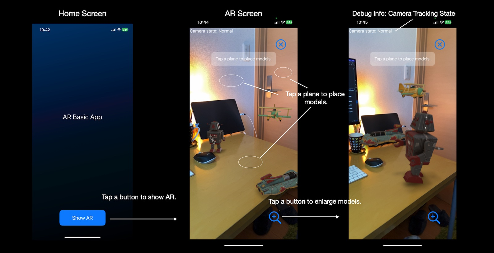
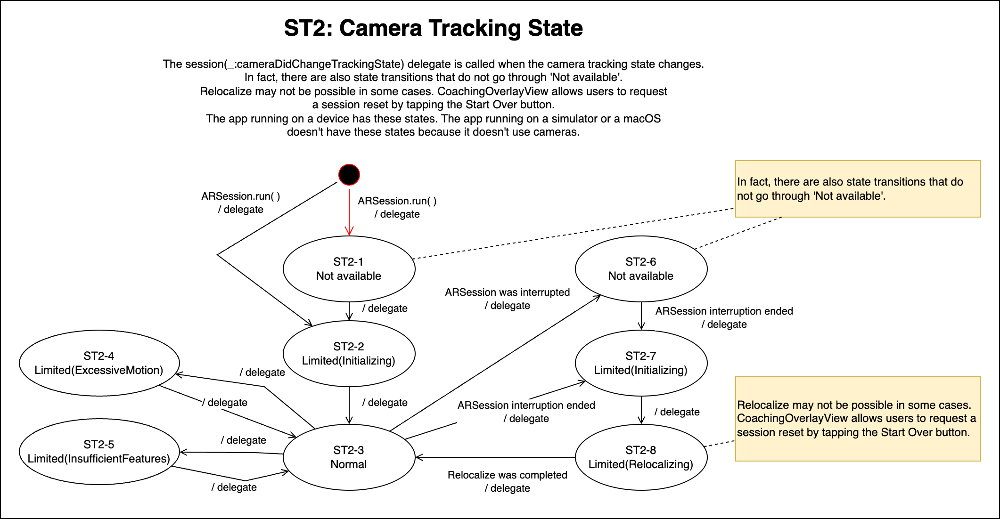

# iOS app - AR Basic App

A minimal iOS AR app that can be used as a template when creating an AR app for the first time.

- Target: iPhone / iOS 16.0+, iPad / iPadOS 16.0+, Mac/M1/M2 / macOS 13.0+
- Build: macOS 13.2+, Xcode 14.2+
- Targets: iPhone / iPad / Mac (Designed for iPad)
- SDK: SwiftUI, ARKit, RealityKit

## Change Log

none

## Abstract

This is a minimal iOS AR app. The purpose of this is showing the basic structure of AR apps.

### Features

- You can place 3D models on a plane by tapping on the horizontal or vertical plane.
You can tap other planes to move the models.
- The baked animations of the model, such as walking, are played.
- The procedural frame animations, such as moving in a circle, are played.
- The spacial audio is played.
- You can change the size of the models by tapping the resize button.
- If the relocalize doesn't end, you can reset the AR session by tapping the `Start Over` button
in the Coaching Overlay View.

### Stage Manager

- In the case of Single window, AR display using camera images is performed.
- In the case of Multi windows, the camera image stops.
The AR Scene's rendering loop continues, so frame-by-frame animations are played.

### Devices

- iPhone / iPad: can display AR scenes using cameras on the device.
- Simulator / Mac with M1/M2: can display VR scenes, without cameras.

### Configuration

You can modify the app with the `AppConfig.swift` file.
- displaying AR debug options: Enable | Disable
- enabling the Environment Texturing: Enable | Disable
- enabling the Object Occlusion: Enable | Disable
- enabling the People Occlusion: Enable | Disable
- background color of AR scene when running on simulator or macOS: `UIColor`
- AR scene scales that user can change: `[SIMD3<Float>]`
- scale and position of models when running on simulator or macOS:
`SIMD3<Float>, SIMD3<Float>`

### Procedural Animations

You can modify the procedural frame animation.
- The assets of AR/VR scenes are defined in `ARSceneSpec.swift` file.
It defines the USDZ model files, sound files, and procedural animation's parameters.
- The procedure of frame animations is defined in `AnimationModel.swift` file.
It defines a simple movement in a circle.

### Assets

This project contains a few USDZ models and audio files as samples.
- USDZ models: `toy_robot_vintage.usdz`, `toy_biplane.usdz`, and `toy_car`
These are from the Apple's AR Quicklook library.
(https://developer.apple.com/augmented-reality/quick-look/)
- Sound files: `robotSound.mp3`, `planeSound.mp3`, and `carSound.mp3` (all free assets)

## Design

### Xcode project

- Choose a template for your new project: Multiplatform: `iOS`, Application: `App`
- Choose options for your new project: Interface: `SwiftUI`, Language: `Swift`

At project settings;
- Info: iOS Development Target: `16.0`

At targets settings;
- Info: Custom iOS Target Properties - add key `Privacy - Camera Usage Description` 
and value `The app will use the camera for AR.`

### Type Structure

### ST1: Camera Authorization

- The app runs AR sessions using AR camera mode needs to as the user for the authorization 
to use cameras on a device.
- The app running on a device has these states. The app running on a simulator or a macOS 
doesn't have these states because it doesn't use cameras.

### ST2: Camera Tracking State

- The session(_:cameraDidChangeTrackingState) delegate is called when the camera tracking state changes.
- In fact, there are also state transitions that do not go through 'Not available'.
- Relocalize may not be possible in some cases. CoachingOverlayView allows users to request
a session reset by tapping the Start Over button.
- The app running on a device has these states. The app running on a simulator or a macOS
doesn't have these states because it doesn't use cameras.

### ST3: ARSession State

- The session delegate is called when the AR session's state changes.
- The AR session can run when the app is foreground and its window is only one in the screen.
- In other cases, such as being in background or displaying multi-windows, the AR session will be interrupted.
- During the AR session is interrupted, the camera feeds are not processed. However if the app is foreground,
the ARView's scene continues updating.
- If an error occurs, you need to restart the AR session to recover from the error.
- The app running on a device has these states. The app running on a simulator or a macOS
doesn't have these states because it doesn't run AR sessions.

### ST4: CoachingOverlayView State

- The ARCoachingOverlayView can be set to activate automatically according to the camera tracking status.
- The view displays the `Start Over` button during relocalizing.
Users can request the AR session reset by tapping the button.
- The app running on a device has these states. The app running on a simulator or a macOS
doesn't have these states because it doesn't run AR sessions.

### SEQ1: Interactions between SwiftUI View and UIViewController

- An ARViewController: UIViewController manages an ARView.
- With an ARContainerView: UIViewControllerRepresentable, it is treated as a SwiftUI view.
- The ARContentView: View is a SwiftUI view, which is a parent view of the ARContainerView. It provide a UI for an AR scene.
- The ARContainerView will be reproduced when re-rendering the parent view, ARContentView, due to the state changes.

## References

- Apple AR QuickLook: https://developer.apple.com/augmented-reality/quick-look/
- Apple Documentation - ARKit: https://developer.apple.com/documentation/arkit
- Apple Documentation - RealityKit: https://developer.apple.com/documentation/realitykit/

## License

